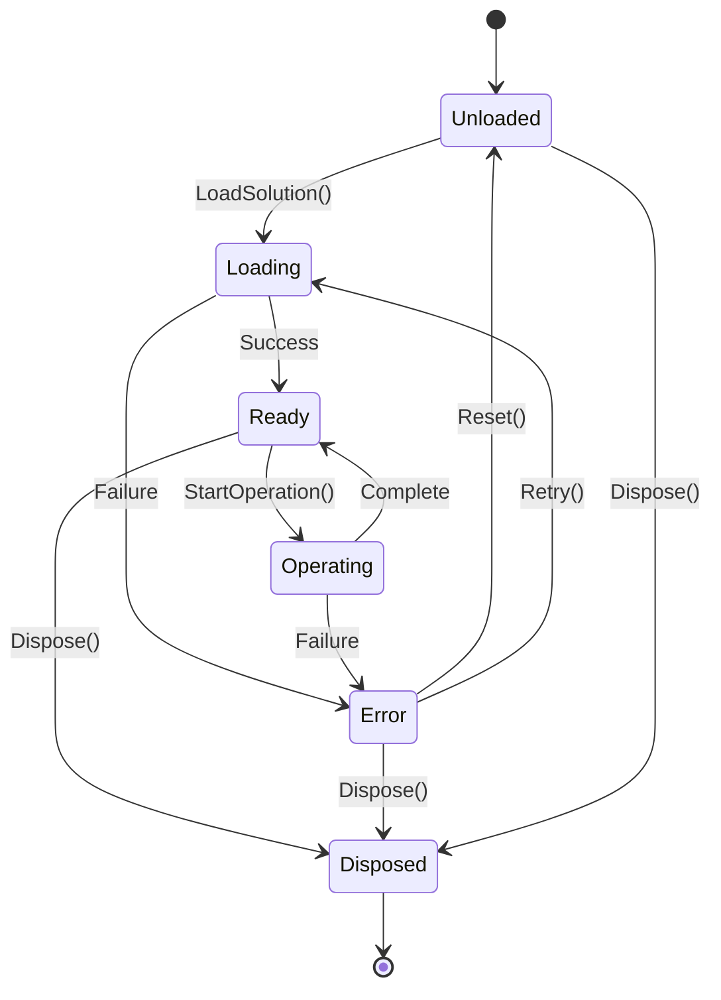
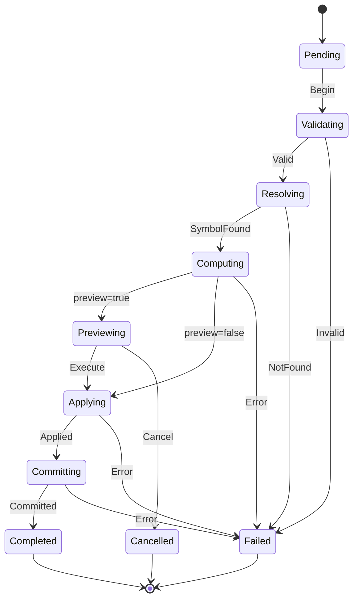

# State Diagrams - Roslyn MCP Move Server

## 1. Workspace Lifecycle States

### 1.1 State Definitions

| State | Description | Valid Operations |
|-------|-------------|------------------|
| Unloaded | Initial state; no solution loaded | LoadSolution, Diagnose |
| Loading | Solution load in progress | Diagnose (limited) |
| Ready | Solution loaded; available for operations | All operations |
| Operating | Refactoring in progress | Diagnose only |
| Error | Load or operation failed | Diagnose, Retry, Reset |
| Disposed | Server shutting down | None |

### 1.2 Transition Rules

| From | To | Trigger | Guard Condition |
|------|----|---------|-----------------|
| Unloaded | Loading | LoadSolution(path) | path is valid |
| Loading | Ready | Load completes | no errors |
| Loading | Error | Load fails | any error |
| Ready | Operating | StartOperation() | no active operation |
| Operating | Ready | Operation completes | success |
| Operating | Error | Operation fails | error during operation |
| Error | Unloaded | Reset() | always |
| Error | Loading | Retry() | previous was LoadFailed |
| Any | Disposed | Dispose() | always |

---

## 2. Refactoring Operation States

### 2.1 State Definitions

| State | Description | Timeout | Recoverable |
|-------|-------------|---------|-------------|
| Pending | Request received, not started | N/A | Yes |
| Validating | Input validation in progress | 5s | Yes |
| Resolving | Finding symbol and references | 30s | Yes |
| Computing | Calculating document changes | 30s | Yes |
| Previewing | Preview mode; changes ready | N/A | Yes |
| Applying | Writing to workspace model | 10s | No |
| Committing | Persisting to filesystem | 30s | No |
| Completed | Operation finished successfully | N/A | N/A |
| Failed | Operation terminated with error | N/A | N/A |
| Cancelled | User cancelled operation | N/A | N/A |

### 2.2 State Transition Table

| From State | Event | To State | Action |
|------------|-------|----------|--------|
| Pending | Begin | Validating | Start validation |
| Validating | ValidationPassed | Resolving | Start symbol resolution |
| Validating | ValidationFailed | Failed | Record error |
| Resolving | SymbolResolved | Computing | Start change computation |
| Resolving | SymbolNotFound | Failed | Record error |
| Resolving | Timeout | Failed | Record timeout |
| Computing | ChangesComputed (preview) | Previewing | Hold changes |
| Computing | ChangesComputed (execute) | Applying | Begin apply |
| Computing | ComputationFailed | Failed | Record error |
| Previewing | Execute | Applying | Resume from preview |
| Previewing | Cancel | Cancelled | Discard changes |
| Applying | ApplySuccess | Committing | Begin persist |
| Applying | ApplyFailed | Failed | Rollback, record error |
| Committing | CommitSuccess | Completed | Finalize |
| Committing | CommitFailed | Failed | Attempt rollback |
| Any (except terminal) | Cancel | Cancelled | Cleanup |

---

## 3. Mermaid Diagrams

### 3.1 Workspace State Machine

### 3.2 Operation State Machine

---

## 4. State Invariants

### 4.1 Workspace Invariants

| Invariant | States | Enforcement |
|-----------|--------|-------------|
| Solution not null | Ready, Operating | Check on transition |
| No active operation | Ready | Check before StartOperation |
| Active operation exists | Operating | Check on entry |
| Resources released | Disposed | Verified on dispose |

### 4.2 Operation Invariants

| Invariant | States | Enforcement |
|-----------|--------|-------------|
| Input validated | Resolving+ | Validation gate |
| Symbol resolved | Computing+ | Resolution gate |
| Changes computed | Applying+ | Computation gate |
| No partial apply | Applying, Committing | Transaction semantics |
| Terminal is final | Completed, Failed, Cancelled | No transitions out |

---

## 5. Error Recovery

### 5.1 Recoverable Failures

| State | Recovery Action | Result |
|-------|-----------------|--------|
| Validating | Fix input, retry | New operation |
| Resolving | Fix symbol ref, retry | New operation |
| Computing | Analyze error, retry | New operation |
| Previewing | Modify params, retry | New operation |

### 5.2 Non-Recoverable Failures

| State | Failure Mode | System Response |
|-------|--------------|-----------------|
| Applying | Workspace corruption | Reload solution |
| Committing | Filesystem failure | Manual recovery needed |

---

## 6. Concurrent State Handling

### 6.1 Allowed Concurrent Access

| Primary State | Allowed Concurrent |
|---------------|-------------------|
| Loading | Diagnose (read-only) |
| Ready | Diagnose (read-only) |
| Operating | Diagnose (read-only) |

### 6.2 Mutual Exclusion

- Only one refactoring operation at a time
- Solution reload blocked during Operating
- Dispose waits for Operating to complete (with timeout)
